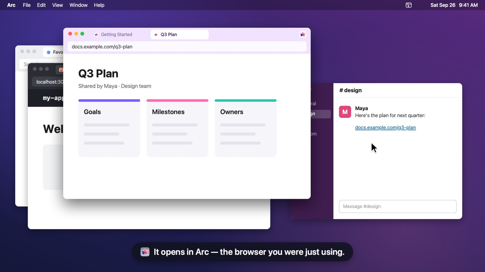

# ActiveBrowser

[](https://github.com/hexember/active-browser/actions/workflows/ci.yml)
[](https://github.com/hexember/active-browser/releases/latest)
[](LICENSE)
[](#install)

**A macOS menu bar agent that opens every link in the browser you were just using.**

No rules to write. No picker to click. You set it as your default browser once, and from then on a link clicked anywhere — Slack, Mail, Notes, Terminal — opens in whichever browser you most recently had in front of you.

```
Reading docs in Arc  →  click a link in Slack  →  opens in Arc
Testing in Brave     →  click a link in Slack  →  opens in Brave
```

That's the whole idea. ActiveBrowser never becomes the thing that displays a page; it receives the URL, decides which real browser should get it, hands it over, and gets out of the way.

<video src="media/showcase.mp4" poster="media/showcase-poster.jpg" width="1280" height="720" style="width:100%;height:auto" autoplay muted loop playsinline controls preload="auto" aria-label="A chat link opens in Arc while you work in Arc; after you switch to Brave, the next link opens in Brave, demo video">
  <a href="media/showcase.mp4">Watch the 30-second demo (MP4)</a>
</video>

<!--  -->
[](https://hexember.github.io/active-browser/)
<!--  -->

**Contents:** [Why](#why-this-exists) · [Install](#install) · [Using it](#using-it) · [Privacy](#privacy) · [Limitations](#known-limitations) · [Uninstall](#uninstall) · [Contributing](#contributing) · [Source on GitHub](https://github.com/hexember/active-browser)

---

## Why this exists

macOS lets you pick exactly **one** default browser. If you use more than one — a work profile and a personal one, a dev browser and a daily driver — every link goes to the same place and you spend your day copy-pasting URLs between browsers.

The existing tools solve this, but all of them ask you to make a decision:

| Tool | How it decides | What it costs you |
|---|---|---|
| **Finicky** | Rules in a JavaScript config file — regex on the URL, matched to a browser | You write and maintain a config. Every new site or edge case is another rule. |
| **Velja** | Rules, plus per-link overrides | Same rule-writing, with a nicer UI |
| **Browserosaurus / Choosy / Bumpr** | Shows you a picker on every link | A click and a decision, every single time |

ActiveBrowser uses a different signal entirely: **your recent focus**. You already told the system which browser you're working in — by working in it. No config file, no rules, no prompt.

- **A rules-based tool is the better choice** when routing depends on the *URL*: "all `github.com` links open in the work profile", "Zoom links bypass the browser". Use Finicky or Velja. ActiveBrowser has no idea what the URL says and deliberately doesn't look.
- **ActiveBrowser is the better choice** when routing depends on *what you're doing right now*, and the same link would reasonably go to different browsers depending on the hour. Rules handle that badly, because the rule would have to encode your context, and your context changes all day.

The two approaches aren't rivals so much as answers to different questions: *where does this URL belong?* versus *where am I working?*

---

## Install

```sh
curl -fsSL https://raw.githubusercontent.com/hexember/active-browser/main/install.sh | sh
```

Then click the ActiveBrowser icon in the menu bar, choose **Set as Default Browser**, and accept the macOS confirmation dialog. The row then reads **✓ Default Browser**.

The script checks your macOS version and CPU architecture, verifies the download's SHA-256 checksum, and validates the app bundle *before* it replaces anything. Re-running it is the upgrade path — it quits the running app first, so it's safe to run with the app open. The script itself never uses `sudo`, and never touches your settings, your login items, or your default-browser choice.

On its first launch from `/Applications`, the app adds itself as a login item, so it's already running the first time you click a link after a restart. You can turn that off from the menu — see [Using it](#using-it).

**Requirements:** macOS 13 (Ventura) or later, Apple silicon. Released builds are `arm64`; on an Intel Mac the installer refuses with a clear message rather than installing something that won't run.

**Why there's no Gatekeeper prompt:** the app is ad-hoc signed, not notarized. `curl` doesn't set the quarantine attribute, so a `curl`-installed copy opens without a warning. Downloading the zip through a browser *would* quarantine it, so use the one-liner. [SECURITY.md](SECURITY.md#what-youre-trusting-when-you-install-this) spells out what you're trusting.

### Build from source

```sh
git clone https://github.com/hexember/active-browser.git
cd active-browser
make install
```

This needs a Swift 6 toolchain, and it works on Intel Macs too. See [CONTRIBUTING.md](CONTRIBUTING.md#build-and-run) for the other build targets.

---

## Using it

Click the ActiveBrowser icon in the menu bar. Hovering over it shows the same `Routing to: …` line as a tooltip.

```
Routing to: Arc                          ← where the next link goes, right now
Recent: Arc › Brave Browser › Safari     ← your focus order (first three, then › …)
──────────
Browsers           ▸  ✓ Arc  ✓ Brave Browser  ✓ Safari   ← who participates
Fallback Browser   ▸  ✓ Arc    Brave Browser    Safari   ← used before you've focused a browser
──────────
Set as Default Browser                   ← becomes "✓ Default Browser" once it is
✓ Launch at Login
──────────
Quit ActiveBrowser                  ⌘Q
```

`Recent:` reads `Recent: none yet` until you focus a browser, and `Routing to:` reads `none` if no browser can be resolved.

**Browsers** lists every app registered to open `https` links, once each — which can include apps that aren't really browsers. Untick one and it stops participating: focusing it no longer affects routing, and it drops out of your focus history. Useful for a browser you keep open but don't want links in. The one exception: if none of the browsers in your focus history is still installed *and* your Fallback Browser has been removed from disk, the last-resort step (see below) can still pick an unticked browser rather than drop the link. The last remaining ticked browser can't be unticked — its row is greyed out, because that would leave nowhere to send a link.

**Fallback Browser** lists your ticked browsers; the checked one is used when the routing chain has nothing better, most commonly right after login when you haven't focused a browser yet. Untick the browser currently set as fallback and the fallback moves to the first remaining ticked browser in menu order (alphabetical).

**Launch at Login** is on by default for a copy in `/Applications`. Untick it and the app remembers, so it won't re-add itself at the next launch. If the row shows a dash (`–`) instead of a checkmark, the login item was switched off in System Settings; clicking the row opens System Settings → Login Items, where only you can switch it back on.

On first launch every detected browser is ticked, and the Fallback Browser is set to the first one alphabetically.

Runs as a background agent: no Dock icon, no windows, about 12 MB of memory idle.

Your settings persist across restarts. The menu re-scans for newly installed browsers each time you open it.

### How a URL is routed

1. The most recently focused **included** browser that is **currently running**
2. Otherwise the most recently focused included browser, even if it isn't running (it gets launched)
3. Otherwise your **Fallback Browser**
4. Otherwise the first installed `https` handler by name — even one you've unticked

A candidate is only used if the app still exists on disk; otherwise the next step is tried.

ActiveBrowser always hands a link to some browser. Only if no browser can be found at all is a link left unopened, and even then it's logged rather than silently lost — and ActiveBrowser filters its own bundle id out of every step, so a link can't be routed back into it in a loop.

The focus history lives in memory only, so after a relaunch or a login it's empty and links go to your Fallback Browser until you focus a browser. ActiveBrowser also registers as a low-priority viewer for `.html` and `.xhtml` files — macOS won't list it as a browser otherwise — so it can appear in Finder's *Open With*, and any file it's handed is routed the same way as a link.

---

## Privacy

- **What it sees:** every URL it is handed (links, plus any `.html` file opened with it), and which app comes to the front. It only records focus for browsers you've ticked.
- **What it doesn't do:** no network requests of any kind, no telemetry, and it never writes URLs to disk or logs them. It never inspects or matches on URL contents; routing is based purely on focus order.
- **What it stores:** three `UserDefaults` keys in the `com.local.activebrowser` domain, all local — `includedBrowsers` (which browsers participate), `defaultBrowser` (your Fallback Browser), and `launchAtLoginOptOut` (whether you turned Launch at Login off). The focus order is kept in memory only.

The installer is the only part that touches the network: the one-liner fetches the script from `raw.githubusercontent.com`, and the script asks `api.github.com` for the latest release tag (skipped when a version is pinned) and downloads the release from `github.com/hexember/active-browser/releases`. Installing from a local zip makes no network access at all.

---

## Known limitations

- **Intel Macs:** released builds are `arm64` only. [Build from source](#build-from-source) instead.
- **Not notarized:** install with the one-liner or from source; a zip downloaded through a browser is quarantined (see [Install](#install)).
- **Routing ignores the URL.** By design — see [Why this exists](#why-this-exists). If you need per-site rules, use Finicky or Velja.
- **`http`/`https` only** (plus the `.html` files described above). Other schemes are left to the system.
- **Links go to the Fallback Browser after a launch** until you focus a browser, because the focus history isn't saved.

---

## Uninstall

Order matters. Reset your default browser first, so a link clicked mid-uninstall can't relaunch ActiveBrowser. And remove the login item last — removing it while the app is still installed lets the next launch re-create it.

1. Set your real default browser back in System Settings → Desktop & Dock.
2. Quit and delete the app:

   ```sh
   pkill -x ActiveBrowser
   rm -rf /Applications/ActiveBrowser.app
   defaults delete com.local.activebrowser   # optional: drop saved settings
   ```

3. System Settings → General → **Login Items & Extensions** → select ActiveBrowser → **−**.

---

## Contributing

Source code, issues and releases live at [github.com/hexember/active-browser](https://github.com/hexember/active-browser). Contributions are welcome. [CONTRIBUTING.md](CONTRIBUTING.md) covers building, the macOS gotchas that will otherwise cost you an hour, the architecture, the design constraints, testing, and releasing.

Please also read the [Code of Conduct](CODE_OF_CONDUCT.md). For security issues, see
[SECURITY.md](SECURITY.md) — report privately, not in a public issue.

## Changelog

See [CHANGELOG.md](CHANGELOG.md).

## License

[MIT](LICENSE).
